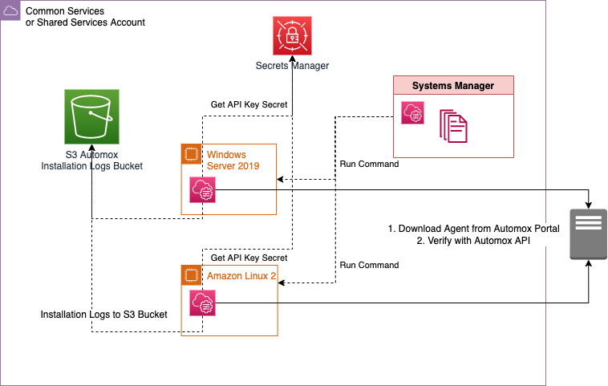

# Systems Manager Automox Continuous Deployment

Using a combination of [Systems Manager State Manager](https://docs.aws.amazon.com/systems-manager/latest/userguide/systems-manager-state.html), [State Manager Associations](https://docs.aws.amazon.com/systems-manager/latest/userguide/systems-manager-state-manager-targets-and-rate-controls.html), [AWS Secrets Manager](https://aws.amazon.com/secrets-manager/), and an [SSM Document](https://docs.aws.amazon.com/systems-manager/latest/userguide/sysman-ssm-docs.html), you can install [Automox](https://www.automox.com/) on Systems Manager Managed EC2 Instances and ensure installation of Automox on all new instances, in an account.

See "Prerequisites" for requirements to leverage this pattern. 

## Prerequisites

### If deploying with Terraform

- An [AWS account](https://aws.amazon.com/premiumsupport/knowledge-center/create-and-activate-aws-account/) that you can deploy the infrastructure in.
- [AWS Command Line Interface (AWS CLI) installed](https://docs.aws.amazon.com/cli/latest/userguide/getting-started-install.html) for setting your AWS credentials for local deployment.
- [Download](https://developer.hashicorp.com/terraform/downloads) and set up Terraform by following the [instructions](https://developer.hashicorp.com/terraform/tutorials/aws-get-started) in the Terraform documentation.
- [Git](https://git-scm.com/) (if you’re provisioning from a local machine).
-  A [role](https://docs.aws.amazon.com/IAM/latest/UserGuide/id_roles.html) within the AWS account that you can use to create AWS resources.
- Automox Subscription with an [API Key](https://help.automox.com/hc/en-us/articles/5385455262484-Managing-Keys).
- [EC2](https://aws.amazon.com/ec2/) Instances with the [SSM Agent](https://docs.aws.amazon.com/systems-manager/latest/userguide/ssm-agent.html) installed.
- EC2 Instances with internet connectivity, in order to validate with the Automox API and download and install the Automox Agent.
- EC2 Instances with an [EC2 IAM instance profile](https://docs.aws.amazon.com/IAM/latest/UserGuide/id_roles_use_switch-role-ec2_instance-profiles.html) allowing SSM functionality.
- Ensure the [.tfvars](https://developer.hashicorp.com/terraform/tutorials/configuration-language/variables) file has all variables defined or define all variables at “Terraform Apply” time.

### If deploying with CloudFormation

- An AWS Account to deploy the infrastructure within.
- A role within the AWS account that you are able create AWS resources with.
- Automox Subscription with an API Key.
- EC2 Instances with the SSM Agent installed.
- EC2 Instances with internet connectivity, in order to validate with the Automox API and download and install the Automox Agent.
- EC2 Instances with an instance profile allowing SSM functionality.

## Limitations 

* This pattern [cURLs](https://curl.se/docs/manpage.html) directly from the [Automox Portal](https://console.automox.com/) in order to minimize creation of AWS resources to deploy the solution, this requires upstream trust of the integrity of the Automox repository.
* This pattern only installs Automox on Windows and Linux Operating Systems Operating Systems with the SSM Agent installed.

## Product versions

Supported Operating Systems:
* Windows Operating Systems with SSM Agent Installed and [PowerShell](https://learn.microsoft.com/en-us/powershell/scripting/overview?view=powershell-7.3) enabled
* Linux Operating Systems with SSM Agent Installed and [Bash](https://www.gnu.org/software/bash/manual/html_node/index.html) enabled

Terraform Structure
```
├── automox_install_multi_os.tf
├── infrastructure.tf
├── sm_sec.tf
├── local_deploy.tfvars
├── variables.tf
└── outputs.tf
```
## Terraform Module details

1. `local_deploy.tfvars` defines the Terraform variables to be used at apply time.
2. `variables.tf` defines the required variables to deploy the solution.
3. `infrastructure.tf` creates the resources necessary to set up systems manager fo continuous deployment and endpoint compliance.
4. `sm_sec.tf` creates the secrets in Secrets Manager for storing API keys.
4. `automox_install_multi_os.tf` creates the SSM Document which contains shellcode for Automox installation both Windows and Linux operating systems.
5. `outputs.tf` defines the outputs as a result of the resources created.

## Target technology stack  

* Amazon EC2 Instances
* AWS Systems Manager Inventory
* AWS Systems Manager Compliance Check
* AWS Systems Manager SSM Documents
* Secrets Manager
* Automox

## Target architecture 



## Automation and scale

* This pattern is intended to be used at scale, for the Terraform modules, instead of deploying it locally, the Terraform modules can be used in a multi-account strategy environment, such as in an AWS Control Tower with Account Factory for Terraform environment. In that case, a backend state S3 bucket should be used for managing Terraform state files, instead of managing the configuration state locally. For the CloudFormation template, it can be deployed as a StackSet.

* To deploy for scaled use, deploy the solution to one central account, such as “Shared Services/Common Services” from a Control Tower or Landing Zone account model. For most efficient usage of resources, assuming there is only one Automox account for the environment, the Automox Secret should be centralized in a single account, and shared cross account, reducing Secrets Manager cost. Grant consumer accounts permission to access to the Secrets Manager Automox Secret, such as with Attribute Based Access Control (ABAC). For example, in an Account Vending Machine or Account Factory for Terraform, add permissions to each account baseline or account customization baseline to have access to the Automox Secret in the Shared Services/Common Services account. 

## FAQ

_Why not "bake" Automox into an [AMI](https://docs.aws.amazon.com/AWSEC2/latest/UserGuide/AMIs.html) with a Golden Image Pipeline?_

You should, but for scenarios where you do not have one or you need to bring live or orphaned instances into compliance quickly, this solution solves that.

_Why not check instance compliance with a [Custom Config Rule](https://docs.aws.amazon.com/config/latest/developerguide/evaluate-config_develop-rules.html) and a [Lambda function](https://docs.aws.amazon.com/lambda/latest/dg/welcome.html) for the existence of Automox and remediate only if they do not comply with the config rule?_

This produces a similar end result, but requires moving the code that is in the SSM Document to exist in a Lambda function for the custom config rule, and that Lambda function cannot be used as easily to scale out as an SSM Document. That architecture also requires enablement of AWS Config and requires more resources and cost for customers.

_Why run these against all instances in Systems Manager and not a subset or a set of [untagged instances](https://docs.aws.amazon.com/AWSEC2/latest/UserGuide/Using_Tags.html)?_

This solution is intended for less governed environments, where resources may be untagged or an unknown number of instances may not have endpoint tooling. This is common when you need to govern development or test environments which may have teams spinning up instances which do not follow a standard.

## Deployment steps
### Terraform Deployment
#### Local deployment
1. Setup your AWS temporary credentials.

   See if the AWS CLI is installed: 

``` bash
   $ aws --version
   aws-cli/1.16.249 Python/3.6.8...
```

&nbsp;&nbsp;&nbsp;&nbsp;&nbsp;&nbsp;&nbsp;&nbsp;&nbsp;AWS CLI version 1.1 or higher is fine.

&nbsp;&nbsp;&nbsp;&nbsp;&nbsp;&nbsp;&nbsp;&nbsp;&nbsp;If you instead received `command not found` then install the AWS CLI.

2. Run aws configure and provide the following values:
``` bash
 $ aws configure
 AWS Access Key ID [*************xxxx]: <Your AWS Access Key ID>
 AWS Secret Access Key [**************xxxx]: <Your AWS Secret Access Key>
 Default region name: [us-east-1]: <Your desired region for deployment>
 Default output format [None]: <Your desired Output format>
```
3. Clone the repository with HTTPS or SSH

   _HTTPS_
``` bash
git clone https://github.com/aws-samples/systems-manager-continuous-deployment-automox.git<fill>
```
&nbsp;&nbsp;&nbsp;&nbsp;&nbsp;&nbsp;&nbsp;&nbsp;&nbsp;_SSH_

``` bash
git clone git@github.com:aws-samples/systems-manager-continuous-deployment-automox.git<fill>
```
4. Navigate to the directory containing the Terraform before running the commands below:
``` bash
cd systems-manager-continuous-deployment-automox/terraform-deploy
```

5. Update the placeholder variable values in local_deploy.tfvars with your desired configuration. 
``` properties
account_id                    = "<DEPLOYMENT-ACCOUNT-ID>"
aws_region                    = "us-east-1"
aws_s3_automox_log_bucket     = "example-automox-logging-bucket-0123"
aws_ec2_instance_profile      = "example-ec2-instance-profile-role"
ssm_association_name          = "EndpointToolingCompliance"
compliance_severity           = "HIGH"
cron_expression               = "cron(0 23 23 ? * * *)"
```

6. The following command initializes, validates and applies the terraform modules to the environment using the variables defined in your .tfvars file:
``` bash
terraform init && terraform validate && terraform apply -var-file local_deploy.tfvars -auto-approve
```
Enter the `automox_apikey` value at Apply time as it a sensitive value:
``` bash
var.automox_apikey
  Enter the Automox API Key.

  Enter a value:
```

7. After successful completion of your first Terraform apply, if provisioning locally, you should see this snippet in your local machine’s terminal:
``` bash
Apply complete! Resources: 8 added, 0 changed, 0 destroyed.
```

8. *(Optional)* Teardown the infrastructure with the following commands:
Terraform is not able to force-destroy AWS Secrets Manager Secrets at the time of this was published, so they must be destroyed with the second command.
``` bash
terraform init && terraform validate && terraform destroy -var-file local_deploy.tfvars -auto-approve
```
``` bash
aws secretsmanager delete-secret --secret-id automox/apiKey --force-delete-without-recovery --region <YOUR-DEPLOYMENT-REGION> 
```
### CloudFormation deployment

1. Setup your AWS temporary credentials.

   See if the AWS CLI is installed: 

``` bash
   $ aws --version
   aws-cli/1.16.249 Python/3.6.8...
```

&nbsp;&nbsp;&nbsp;&nbsp;&nbsp;&nbsp;&nbsp;&nbsp;&nbsp;AWS CLI version 1.1 or higher is fine.

&nbsp;&nbsp;&nbsp;&nbsp;&nbsp;&nbsp;&nbsp;&nbsp;&nbsp;If you instead received `command not found` then install the AWS CLI.

2. Run aws configure and provide the following values:
``` bash
 $ aws configure
 AWS Access Key ID [*************xxxx]: <Your AWS Access Key ID>
 AWS Secret Access Key [**************xxxx]: <Your AWS Secret Access Key>
 Default region name: [us-east-1]: <Your desired region for deployment>
 Default output format [None]: <Your desired Output format>
```
3. Clone the repository with HTTPS or SSH

   _HTTPS_
``` bash
git clone https://github.com/aws-samples/systems-manager-continuous-deployment-automox.git<fill>
```
&nbsp;&nbsp;&nbsp;&nbsp;&nbsp;&nbsp;&nbsp;&nbsp;&nbsp;_SSH_

``` bash
git clone git@github.com:aws-samples/systems-manager-continuous-deployment-automox.git<fill>
```
4. Navigate to the directory containing the CloudFormation before running the commands below:
``` bash
cd systems-manager-continuous-deployment-automox/cloudformation-deploy
```

5. Run the following AWS CLI command to create the stack.

   We do not pass in a parameters file in order to avoid saving the API Key in a file. Replace each placeholder _ParameterValue_ with your desired value.

``` bash
aws cloudformation create-stack --template-body file://automox_continuous_deploy.yml --stack-name automox-ssm-cont-deploy \
--parameters ParameterKey=AutomoxAPIKey,ParameterValue="AutomoxAPIKey1234" ParameterKey=AutomoxLogBucket,ParameterValue="example-automox-logging-bucket-0123" ParameterKey=SSMAssociationName,ParameterValue="EndpointToolingCompliance" ParameterKey=ComplianceSeverity,ParameterValue="HIGH" ParameterKey=CRONExpression,ParameterValue="cron(0 23 23 ? * * *)"
```
6. Validate your Stack deployment
After successful completion of your CloudFormation deploy, if provisioning locally, you should see this snippet in your local machine’s terminal:
``` bash
Successfully created/updated stack - automox-ssm-cont-deploy
```


7. (Optional) Delete the CloudFormation Stack
Teardown the infrastructure with the following commands: The CloudFormation Stack does not force destroy AWS Secrets Manager Secrets, so they must be force destroyed with the second command.
``` bash
aws cloudformation delete-stack \
    --stack-name automox-ssm-cont-deploy
```
``` bash
aws secretsmanager delete-secret --secret-id automox/apiKey --force-delete-without-recovery --region <YOUR-DEPLOYMENT-REGION>
```

## Troubleshooting

When running Terraform apply or CloudFormation deploy commands from your local machine, you may encounter an error similar to the following:

``` properties
Error: configuring Terraform AWS Provider: error validating provider credentials: error calling sts:GetCallerIdentity: operation error STS: GetCallerIdentity, https response error StatusCode: 403, RequestID: 123456a9-fbc1-40ed-b8d8-513d0133ba7f, api error InvalidClientTokenId: The security token included in the request is invalid.
```

This error is due to the expiration of the security token for the credentials used in your local machine’s configuration.

See "[Set and View Configuration Settings](https://docs.aws.amazon.com/cli/latest/userguide/cli-configure-files.html#cli-configure-files-methods)" from the AWS Command Line Interface Documentation to resolve.

## References

* [Automox API](https://developer.automox.com/)
* [Terraform Landing Zone with an Account Vending Machine](https://www.hashicorp.com/resources/aws-terraform-landing-zone-tlz-accelerator)
* [AWS Control Tower with Account Factory for Terraform](https://docs.aws.amazon.com/controltower/latest/userguide/taf-account-provisioning.html)
* [Manage AWS Accounts Using Control Tower Account Factory for Terraform](https://learn.hashicorp.com/tutorials/terraform/aws-control-tower-aft?in=terraform/aws)

## Author

* Mike Saintcross [msaintcr@amazon.com](https://github.com/msntx)